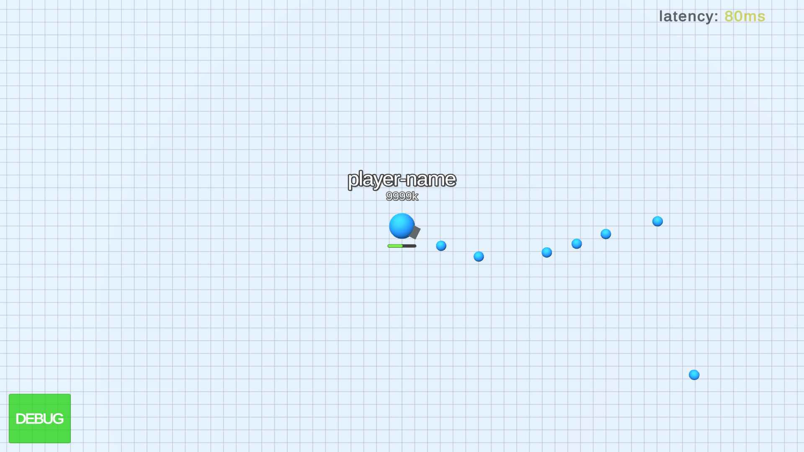
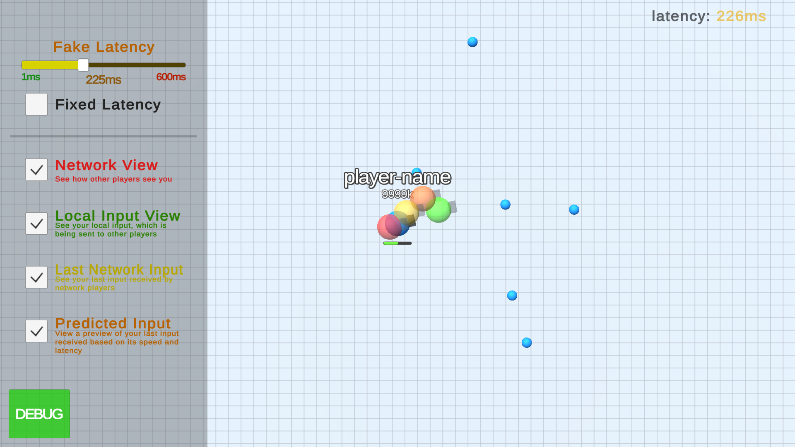

#  Unity Multiplayer Test




## About the project

Unity Multiplayer Test is an awnser to a knowledge test about Multiplayer Netcode with Unity 3D based on the game [Diep.io](https://diep.io/), a [demo](https://jovdev.000webhostapp.com/test-multiplayer-01/) is available

You can read the Requirements Document (pt-br) [here](documentation/documents/requirements-pt-br.jpg)


The project have a "fake websocket server" that simulate an comunication with a extenal server, with ajustable fake latency and can show all perpectives of a player position representation and movement inputs updates (local and network) simultaneously

---

### Getting Started:

##### Cloning the repository:

To open the project in development mode, you need to have an environment configured with [Unity 3D](https://unity3d.com/pt/get-unity/download/archive) (preferably: version ^2020.3.23)

``` 
git clone https://github.com/joveem/Unity-Multiplayer-Test.git
cd Unity-Multiplayer-Test
#
```